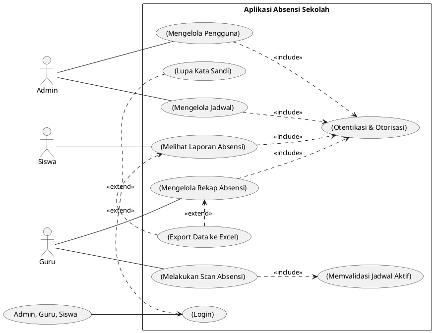
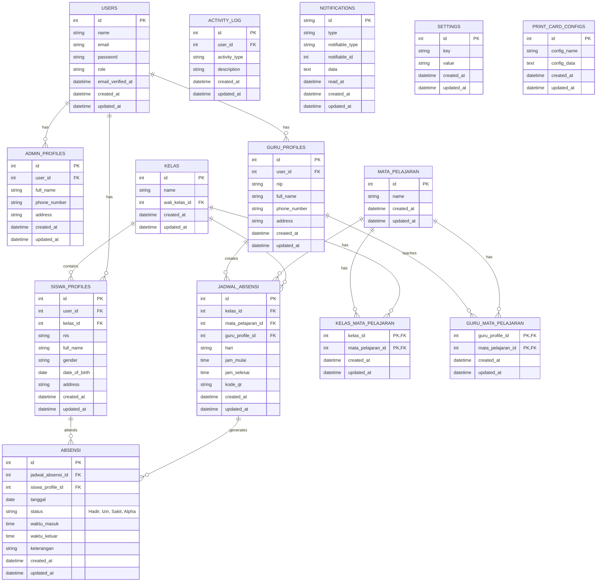
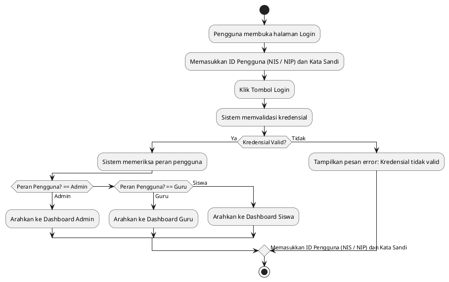
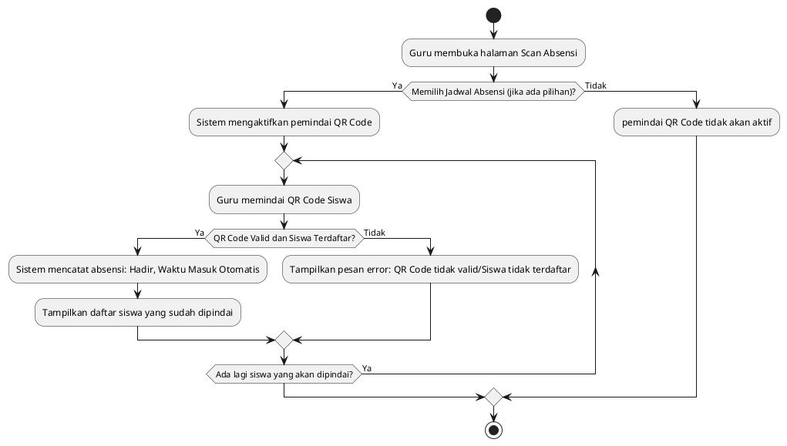
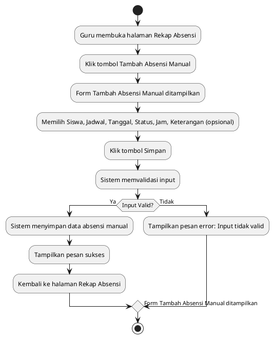
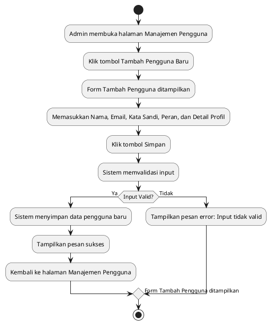
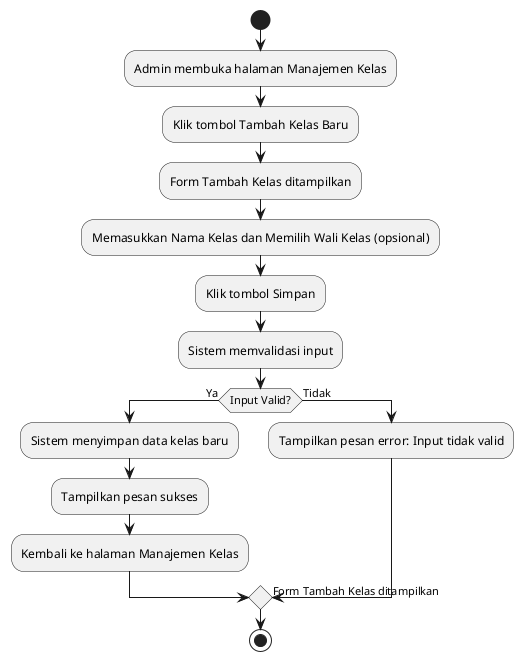
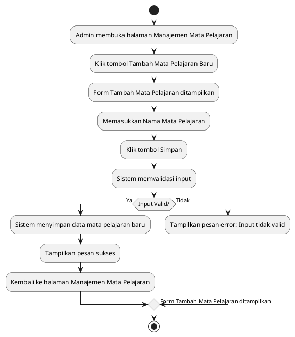
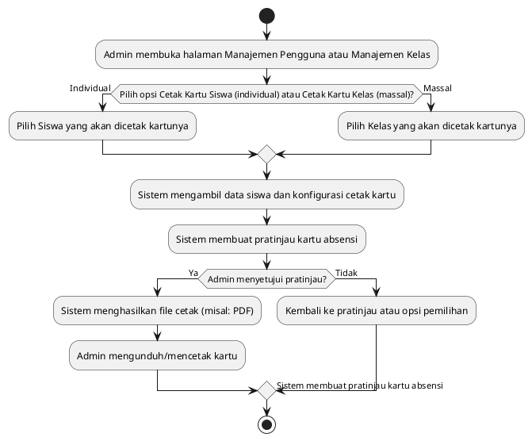
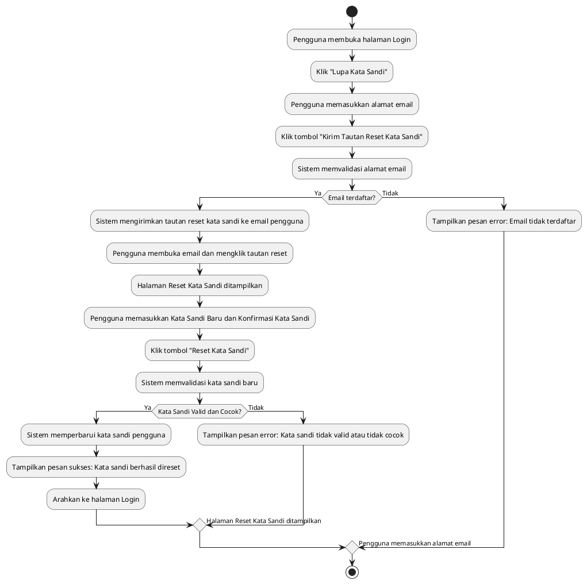

## 1. Diagram Use Case

---

## 2. ERD (Entity Relationship Diagram)

## 3. Activity Diagram untuk Proses Login

---

## 4. Activity Diagram untuk Proses Absensi QR Code

---

## 5. Activity Diagram untuk Proses Tambah Absensi Manual

---

## 6. Activity Diagram untuk Proses Tambah User

---

## 7. Activity Diagram untuk Proses Tambah Kelas

---

## 8. Activity Diagram untuk Proses Tambah Mata Pelajaran

---

## 9. Activity Diagram untuk Proses Cetak Kartu Absensi

---

## 10. Activity Diagram untuk Proses Reset Password

